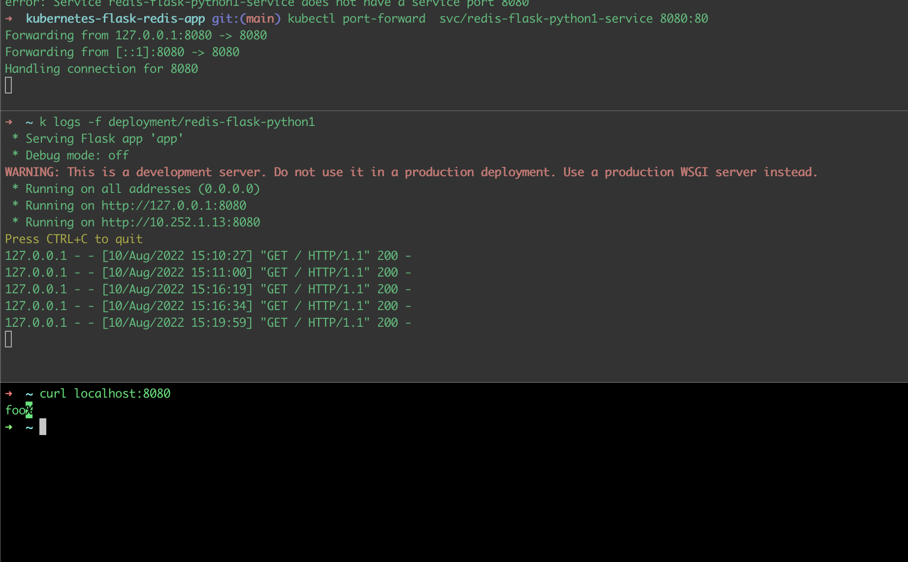

# kubernetes-flask-redis-app




## Deploy redis from the official documentation

```sh

kubectl apply -f https://k8s.io/examples/application/guestbook/redis-leader-deployment.yaml
kubectl apply -f https://k8s.io/examples/application/guestbook/redis-leader-service.yaml
# follower-deploy
kubectl apply -f https://k8s.io/examples/application/guestbook/redis-follower-deployment.yaml
kubectl apply -f https://k8s.io/examples/application/guestbook/redis-follower-service.yaml
```


### Build docker image

```sh
# for linux/platform
docker build --platform linux/x86-64 -t adiii717/demo-app:flask-redis-demo-app .
```


### Deploy Flas application

```sh
kubectl apply -f guestbook-deployment.yaml
```

### Debug
```
kubectl get pods
----------------------------------------------------------------
NAME                                  READY   STATUS    RESTARTS   AGE
redis-flask-python1-7c787cb9d-qd62f   1/1     Running   0          108s
redis-follower-dddfbdcc9-4xhtv        1/1     Running   0          29m
redis-follower-dddfbdcc9-tvbxd        1/1     Running   0          29m
redis-leader-fb76b4755-66g6c          1/1     Running   0          30m
----------------------------------------------------------------
```

### Get logs of the application

```sh
kubectl logs -f deployment/redis-flask-python1
----------------------------------------------------------------
➜  ~ k logs -f deployment/redis-flask-python1
 * Serving Flask app 'app'
 * Debug mode: off
WARNING: This is a development server. Do not use it in a production deployment. Use a production WSGI server instead.
 * Running on all addresses (0.0.0.0)
 * Running on http://127.0.0.1:8080
 * Running on http://10.252.1.13:8080
Press CTRL+C to quit
127.0.0.1 - - [10/Aug/2022 15:10:27] "GET / HTTP/1.1" 200 -
----------------------------------------------------------------
```


### Port forwrd 

```
kubectl port-forward  pod/redis-flask-python1-7c787cb9d-qd62f 8080:8080
```


### Testing

```sh
curl localhost:8080
```