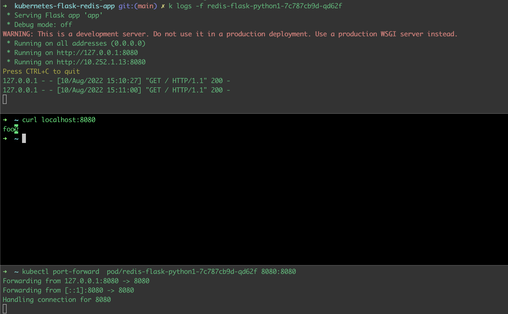

# kubernetes-flask-redis-app


## Deploy redis from the official documentation

```sh

kubectl apply -f https://k8s.io/examples/application/guestbook/redis-leader-deployment.yaml
kubectl apply -f https://k8s.io/examples/application/guestbook/redis-leader-service.yaml
# follower-deploy
kubectl apply -f https://k8s.io/examples/application/guestbook/redis-follower-deployment.yaml
kubectl apply -f https://k8s.io/examples/application/guestbook/redis-follower-service.yaml
```


### Build docker image

```sh
# for linux/platform
docker build --platform linux/x86-64 -t adiii717/demo-app:flask-redis-demo-app .
```


### Deploy Flas application

```sh
kubectl apply -f guestbook-deployment.yaml
kubectl get pods
------------------------
➜  ~ kubectl get pods
NAME                                  READY   STATUS    RESTARTS   AGE
redis-flask-python1-7c787cb9d-qd62f   1/1     Running   0          108s
redis-follower-dddfbdcc9-4xhtv        1/1     Running   0          29m
redis-follower-dddfbdcc9-tvbxd        1/1     Running   0          29m
redis-leader-fb76b4755-66g6c          1/1     Running   0          30m
```
### Port forwrd 
kubectl port-forward  pod/redis-flask-python1-7c787cb9d-qd62f 8080:8080
```


### Testing

```sh
curl localhost:8080
```